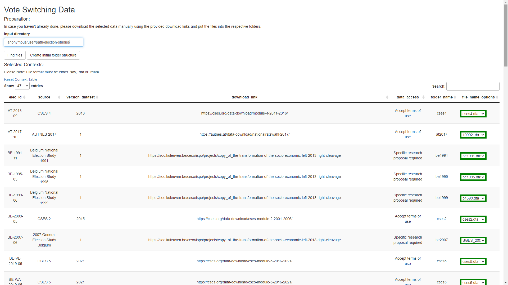

`voteswitchR`: Data and Methods for Analyzing Comparative Vote Switching
Data
================
Denis Cohen (<denis.cohen@uni-mannheim.de>)

## The `voteswitchR` package

The `voteswitchR` package is an open-source R package that offers a
suite of functions for processing and analyzing vote switching data. It
offers a comprehensive software implementation of the conceptual
framework and the various extensions presented in Cohen, Krause, and
Abou-Chadi (2023).

### Installation

To install `voteswitchR`, please run

``` r
remotes::install_github("denis-cohen/voteswitchR")
```

Note that the installation may take up to 30 minutes as several variants
of the proposed MAVCL model, implemented in
[Stan](https://mc-stan.org/), will be compiled during installation. This
pre-compilation facilitates the subsequent use of `voteswitchR`, as the
model won’t have to be recompiled every time users call the main
estimation function `voteswitchR::run_mavcl()`.

### Citation

Please acknowledge the use of `voteswitchR` and the conceptual framework
presented in Cohen, Krause, and Abou-Chadi (2023) by citing the
following:

<a name=bib-voteswitchR></a>[Cohen, Denis](#cite-voteswitchR) (2023).
*voteswitchR: Data and Methods for Analyzing Comparative Vote Switching
Data*. R package version 0.2.0. URL:
<https://github.com/denis-cohen/voteswitchR>.

<a name=bib-Cohen2023></a>[Cohen, Denis, Werner Krause, and Tarik
Abou-Chadi](#cite-Cohen2023) (2023). “Comparative vote switching: A new
framework for studying dynamic multiparty competition”. In: *The Journal
of Politics* (First view).

### Functionality

`voteswitchR` features the following functions:

**For data processing:**

1.  `build_data_file`: Harmonize, impute, map, rake, and aggregate vote
    switching data
2.  `recode_switches`: Recode aggregate switching patterns
3.  `calculate_meas_error`: Calculate measurement error in vote
    switching survey data

**For data analysis:**

1.  `run_mavcl`: Run the MAVCL model
2.  `calculate_pred_error`: Calculate the MAEs and RMSEs of MAVCL
    Predictions
3.  `compute_qoi`: Compute MAVCL quantities of interest

**Package-specific data:**

1.  `mappings`: Mappings of vote choices from surveys to ParlGov and
    MARPOR IDs
2.  `codebook`: Documentations of mappings
3.  `data_guide`: Versions, download links, and access details for
    survey data

On top of these, generalized functions for the visualization of
quantities of interest generated via `compute_qoi()` are currently in
development.

This vignette illustrates the functionality and the use of
`voteswitchR`.

### Video tutorial

A video tutorial, based on a talk in the [MZES Social Science Data
Lab](https://www.mzes.uni-mannheim.de/socialsciencedatalab/page/events/),
is available on [YouTube](https://youtu.be/-35D-mqmrF0).

## Data processing

### Building the data infrastructure: `voteswitchR::build_data_file()`

The primary tool for data processing is the
`voteswitchR::build_data_file()` function. The function launches a
ShinyApp that provides a graphical user interface (GUI) that guides
users through three sequential steps to initialize the HIMRA
(harmonization, imputation, mapping, raking, aggregation) routine.

The first step is **concept and context selection**. The screenshot
below the corresponding slide of the Shiny GUI. Here, users can select
both the concepts (variables) and contexts (elections) they wish to
include in the data processing routine. The concepts “vote choice at
$t$” and “vote choice at $t-1$” are selected by default, as these are
strictly required for the study of vote switching.

<div class="figure">


<p class="caption">
Shiny GUI: Step 1 (concept and context selection)
</p>

</div>

The selection of additional variables can serve three distinct purposes.
First, information on variables such as party identification, left-right
self-placement, or like/dislike-scores of parties can decisively improve
the performance of the imputation of vote choice/vote switching data.
Secondly, users may wish to use any categorical variables to study
subgroup-specific vote switching. For instance, by including information
on respondents’ gender, users can request gender-specific voter
transition matrices for each electoral context. Thirdly, users may wish
to include any additional variables and forego the aggregation step to
use the micro-level data, enriched with contextual information from our
mapping file, to conduct classical analyses of individual or contextual
determinants of vote choice or vote switching.

The following overview indicates the availability of all concepts
available as part of the `voteswitchR` data infrastructure across its
254 electoral contexts:

            Concepts: Availability across all post-election surveys.            
                     Concepts                           V2  
                   ─────────────────────────────────────────
                     Vote choice (t)               254/254  
                     Vote choice (t-1)             254/254  
                     Party ID                      235/254  
                     Strength of party ID, V1      211/254  
                     Strength of party ID, V2      212/254  
                     Left-right self-placement     222/254  
                     Satisfaction with democracy   159/254  
                     Party like-dislike scores     183/254  
                     Left-right party placements   181/254  
                     Gender (binary)               254/254  
                     Age                           251/254  

Column names: Concepts, V2

The second step is **data procurement**. Our data infrastructure is
based on decades of election studies from various countries. Needless to
say, the right to distribute the data lies with the respective owners
and data providers. Therefore, the original election studies cannot be
distributed as a part of the `voteswitchR` package. Instead, they must
be retrieved from the data providers. To facilitate this step as much as
possible, the second screen of the Shiny GUI, shown below, guides users
through this process. First, users can specify a path at which a folder
structure will be initialized (by clicking on **Create initial folder
structure**). This structure will contain a separate sub-directory for
each selected electoral context selected in the previous step.

Users can then consult the data table shown in the screenshot below to
learn about the logistics of data procurement. For each selected
electoral context, the table specifies the corresponding data set
(`source`) and data set version (`version_dataset`), as well as the link
where the data can be downloaded or requested (`download_link`) as well
as the prerequisites for data access (`data_access`). For instance, data
for the 2013 Austrian General Election comes from The Comparative Study
of Electoral Systems, Module 4 (CSES 4, Version 2018), which can be
downloaded from [cses.org](https://cses.org/) after accepting the data
provider’s terms of use.

<div class="figure">


<p class="caption">
Shiny GUI: Step 2 (data procurement)
</p>

</div>

Nearly 60% of all electoral contexts included in `voteswitchR`’s data
processing routine come from comparative projects like CSES 2-5
(Comparative Study of Electoral Systems 2015a, 2015b, 2018, 2020) and
The European Voter Project (The European Voter Project 2005). Thus,
users can get access to comparative vote switching data from over 130
electoral contexts by obtaining only these five data files. The rest of
the electoral contexts come from national election studies, some of
which stipulate more restrictive data access conditions. The table below
gives an overview. Most of the data can be simply downloaded after
accepting the terms of use, sometimes with prior registration at the
data provider’s data portal. For 37 electoral contexts from the European
Voter Project, the data must be requested from
[GESIS](https://search.gesis.org/research_data/ZA3911). For a few
remaining electoral contexts, specific research proposals (and, in some
cases, signed use agreements) are required in order to access the data.
`voteswitchR::data_guide` gives a complete overview of all election
studies and data access logistics.

       An overview of access logistics across all post-election surveys.        
                Data Access                            Frequency  
              ────────────────────────────────────────────────────
                accept terms of use                          158  
                register and accept terms of use              28  
                request access                                37  
                request access and pay provision fee           3  
                request access with specific                  15  
                research proposal                                 
                request access with specific                   8  
                research proposal and sign data use               
                agreement                                         

Column names: Data Access, Frequency

Once users have obtained all election studies for the electoral contexts
they have selected, they must store each data file in the correct
subfolder (given by `folder_name`). Once data procurement is complete,
users must simply click **Find files** in the GUI. `voteswitchR` will
automatically scan the subfolders for data files in Stata (`.dta`), R
(`.RData`) and SPSS (`.sav`, `.por`) formats and display the file name
in the GUI under `file_name_options`. If a single file is found, the
field will turn green. If multiple files are found (e.g., because a
subfolder contains data files in both `.dta` and `.sav` formats), the
field will turn orange; users can then select one of the files from a
drop-down menu. If no data file is found, the field will turn red,
indicating that users should check if they correctly stored the data in
the correct subfolder. Once all fields have turned green, users can
advance to the next slide of the GUI.

The third and final step is the **specification of function arguments**.
A screenshot of the corresponding GUI is shown below. Here, users can
specify input arguments to the HIMRA routine and request their desired
outputs. The first HIMRA step, *harmonization*, is performed by default.
Users can specify whether they want to impute missing values or not. If
the `impute` box is ticked, users can enter the request number of
imputations (`n_imp`) and supply a seed (`seed`) to ensure that the
routine is reproducible. Similarly, users can specify if they want to
`map` the vote switching data to external party and election IDs and
whether they want to `rake` and `aggregate` the corresponding counts
from the election-specific voter transition matrices. Note that mapping
is a prerequisite for both raking and aggregation.

<div class="figure">


<p class="caption">
Shiny GUI: Step 3 (function arguments)
</p>

</div>

The remaining arguments allow users to specify the output to be
returned:

- `return_data`: Return the harmonized unimputed survey data (with an
  extra column `raked_weights` if `rake == TRUE`).
- `return_data_imp`: Return a list of `n_imp` harmonized imputed survey
  data (with an extra column `raked_weights` if `rake == TRUE`).
- `return_agg_data`: Return aggregate counts for each cell of each
  election-specific voter transition matrix, based on the unimputed
  survey data. Raked weights will be used if `rake == TRUE`.
- `return_agg_data_imp`: Return a list of `n_imp` aggregate counts for
  each cell of each election-specific voter transition matrix, based on
  the imputed survey data. Raked weights will be used if `rake == TRUE`.

Once users click **Execute**, the data processing routine will start.
For the current sample of electoral contexts, the routine will take
roughly 15 minutes to complete without imputation and several hours with
imputation. The routine returns an object called `data_file`, which
contains all the requested output. By default, this object will be
stored in the current R environment.

### Data preparation for subgroup-specific voter transition matrices

`voteswitchR:::aggregate_switches()` is an internal package function
that is called in the final step of the HIMRA routine to generate the
aggregate counts for each cell of each election-specific voter
transition matrix that users can request via `return_agg_data` or
`return_agg_data_imp`.

When conducting subgroup-specific analyses, users are advised to apply
this function to the harmonized and mapped (and, optionally, imputed and
raked) micro-level data returned by selecting `return_data`/
`return_data_imp` instead of running it as part of the HIMRA routine.
Applying the aggregation post-hoc allows users to flexibly retrieve
(raked) cell counts for any available subgroup.

The code below illustrates how users can retrieve gender-specific
aggregate counts for each cell of election-specific voter transition
matrices, using multiple imputation and raked weights, by applying this
function to the harmonized and imputed micro-level data stored in
`data_file$data_imp`:

``` r
for (m in seq_along(data_file$raked_switches_imp)) {
  data_file$raked_switches_imp[[m]] <-
    voteswitchR:::aggregate_switches(
      data_file$data_imp[[m]],
      weights_var = "raked_weights",
      subgroup = "male"
    )
}
```

Here, the loop iteratively runs the function across the `n_imp`
imputations. `weights_var` requests the use of raked weights. The
argument `subgroup` specifies a column in `data_file$data_imp[[m]]` that
defines the subgroup.

### Generalized transition matrices

The aggregation step outlined above produces “raw” voter transition
matrices: Each cell count represents switches between specific parties.
An example is given in the table below, which shows the raked cell
counts for the 2010 UK General Election. The column `weights` records
the raked counts for each cell. As we can see, this raw transition
matrix is of dimensions $5 \times 5$ and thus has $25$ cells.

           elec_id         name_from        name_to   weights      n  
         ─────────────────────────────────────────────────────────────
           GB-2010-05         Labour         Labour       196   1577  
           GB-2010-05         Labour        LibDems      38.8   1577  
           GB-2010-05         Labour   Conservative      32.8   1577  
                                                  s                   
           GB-2010-05         Labour         others        14   1577  
           GB-2010-05         Labour     non-voters      58.5   1577  
           GB-2010-05        LibDems         Labour      21.9   1577  
           GB-2010-05        LibDems        LibDems       135   1577  
           GB-2010-05        LibDems   Conservative      27.1   1577  
                                                  s                   
           GB-2010-05        LibDems         others      9.24   1577  
           GB-2010-05        LibDems     non-voters      19.8   1577  
           GB-2010-05   Conservative         Labour      13.4   1577  
                                   s                                  
           GB-2010-05   Conservative        LibDems      15.5   1577  
                                   s                                  
           GB-2010-05   Conservative   Conservative       231   1577  
                                   s              s                   
           GB-2010-05   Conservative         others      19.7   1577  
                                   s                                  
           GB-2010-05   Conservative     non-voters      33.9   1577  
                                   s                                  
           GB-2010-05         others         Labour      4.53   1577  
           GB-2010-05         others        LibDems      10.6   1577  
           GB-2010-05         others   Conservative      11.5   1577  
                                                  s                   
           GB-2010-05         others         others      49.8   1577  
           GB-2010-05         others     non-voters      24.3   1577  
           GB-2010-05     non-voters         Labour      61.5   1577  
           GB-2010-05     non-voters        LibDems      36.1   1577  
           GB-2010-05     non-voters   Conservative        69   1577  
                                                  s                   
           GB-2010-05     non-voters         others      29.2   1577  
           GB-2010-05     non-voters     non-voters       414   1577  

Raw (party-specific) raked vote switching counts, 2010 UK General
Election.

Column names: elec_id, name_from, name_to, weights, n

Users can use `voteswitchR::recode_switches()` to convert such “raw”
voter transition matrices into generalized transition matrices by
recoding the switches to a meaningful scheme for comparative inquiries.
For instance, we could re-express the party-specific switches as
switches between governing parties, opposition parties, and non-voters,
thus reducing the context-specific $5 \times 5$ transition matrix to a
generalized $3 \times 3$ matrix that is universally applicable to all
electoral contexts. In the context of the 2010 UK General Election, the
incumbent government was a single-party majority government led by
Labour, whereas the Conservatives, Liberal Democrats, and others
constituted the opposition. As a result, we can re-express the voter
transition matrix as follows:

             elec_id        gov_from       gov_to   weights      n  
           ─────────────────────────────────────────────────────────
             GB-2010-05   government   government       196   1577  
             GB-2010-05   government   non-voters      58.5   1577  
             GB-2010-05   government   opposition      85.6   1577  
             GB-2010-05   non-voters   government      61.5   1577  
             GB-2010-05   non-voters   non-voters       414   1577  
             GB-2010-05   non-voters   opposition       134   1577  
             GB-2010-05   opposition   government      39.9   1577  
             GB-2010-05   opposition   non-voters        78   1577  
             GB-2010-05   opposition   opposition       509   1577  

Generalized raked vote switching counts: Switches between government
party  
(Labour), opposition parties (Conservatives, Liberals, Others), and
non-voters in the 2010 UK General Election.

Column names: elec_id, gov_from, gov_to, weights, n

`voteswitchR::recode_switches()` implements this data-processing step as
follows:

``` r
model_data <- data_file$raked_switches_imp[[1]] %>%
  voteswitchR::recode_switches(
    mappings = voteswitchR::mappings %>%
      dplyr::mutate(
        gov = case_when(
          outgoing_cabinet_party_lag == 1 ~ "government",
          TRUE ~ "opposition"
        )
      ),
    switch_factor = "gov",
    type = "elections",
    assign_others = "opposition"
    )
```

The argument `mappings` accepts a copy of the mapping file,
`voteswitchR::mappings`, in which we here generate a categorical
variable called `gov` that assigns each party in the mapping file to one
of two categories: government or opposition. The argument
`switch_factor` then specifies that this variable will be used for the
construction of the generalized voter transition matrix. In this step,
the three categories of `gov` are supplemented by codes for residual
other parties that are not included in the mapping file and for
non-voters. By using the argument `assign_others = "opposition"`, users
can specify that the former are subsumed under the category “opposition”
and not assigned a distinct “others” category. Note that by changing the
argument `type` from `elections` to `party-elections`, users can
determine whether they want to obtain election-specific or
party-specific voter transition matrices. An optional `subgroup`
argument (not used here) allows users to specify that subgroup-specific
“raw” voter transition matrices generated via
`voteswitchR::aggregate_switches()` are processed into subgroup-specific
generalized voter transition matrices.

`voteswitchR::recode_switches()` returns a list of three objects
required for estimation and post-estimation:

- `data`: Model data, including a separate column for each cell-specific
  switching pattern of the generalized voter transition matrix (“wide
  format”).

- `y_names`: The column names of the outcome variable, i.e., the $C^2$
  cells of the voter transition matrix.

- `y_structure`: A list of data frames that specifies, for each marginal
  category of the voter transition matrix, the conceptual meaning for
  each cell. An example for government parties, stored under
  `model_data$y_structure$government` in the table. From the perspective
  of government parties, cell \#1, which records the switching pattern
  `government_government`, constitutes a retention cell. Cells \#2 and
  \#3 (`government_non`, `government_opposition`) are loss cells.
  Conversely, cells \#4 and \#7 (`non_government`,
  `opposition_government`) are gain cells. All other switching patterns
  do not involve government partners and are thus neither gain, loss,
  nor retention cells. Analogous information is included for the other
  two categories under `model_data$y_structure$opposition` and
  `model_data$y_structure$non`, respectively.

                  cat          switch                  type    
                ───────────────────────────────────────────────
                  government   government_government   retain  
                  government   government_non          loss    
                  government   government_opposition   loss    
                  government   non_government          gain    
                  government   non_non                 resid   
                  government   non_opposition          resid   
                  government   opposition_government   gain    
                  government   opposition_non          resid   
                  government   opposition_opposition   resid   
             Conceptual meaning of each cell for governing parties.             

Column names: cat, switch, type, dyad, pos

3/5 columns shown.

### Quality checks

Despite its elaborate data-processing routine, `voteswitchR`’s toolbox
does not offer a no panacea for turning a bad survey data set into a
good one. To inspect how strongly survey data deviate from true election
results, `voteswitchR` provides the `calculate_meas_error()` function.
This function allows users to compute party-election-specific
directional errors and election-level mean absolute errors or root mean
squared errors, using either nominal parties or a user-supplied
comparative scheme to define the marginal categories of voter transition
matrices. These metrics allow users to assess the quality of the
underlying survey data. While by no means a perfect measure, it is the
best available – and the only objective – criterion for assessing the
accuracy of (unraked) survey-based transition matrices in terms of their
marginal vote proportions. These can then guide users in their decisions
on context inclusion and robustness checks.

``` r
meas_error <- calculate_meas_error(
  switches = data_file$switches,
  mappings = voteswitchR::mappings %>%
      dplyr::mutate(
        gov = case_when(
          outgoing_cabinet_party_lag == 1 ~ "government",
          TRUE ~ "opposition"
        )
      ),
  switch_factor = "gov",
  type = "mae"
)
```

The function returns summaries that showcase the deviations of (unraked)
vote proportions from true vote shares at both $t-1$ and $t$. This
information is available for each cell of the election-specific voter
transition matrix and for elections at large, as illustrated below:

``` r
meas_error$elec_errors %>%
  dplyr::mutate_if(is.numeric, ~round(., 3)) %>%
  head(8)
```

                 ┌────────────────────────────────────────────┐
                 │ elec_id      mean_error_t   mean_error_tm1 │
                 ├────────────────────────────────────────────┤
                 │ AT-2013-09          0.087            0.104 │
                 │ AT-2017-10          0.039            0.064 │
                 │ AU-1987-07          0.056            0.06  │
                 │ AU-1990-03          0.05             0.052 │
                 │ AU-1993-03          0.045            0.066 │
                 │ AU-1996-03          0.042            0.022 │
                 │ AU-1998-10          0.048            0.024 │
                 │ AU-2001-11          0.052            0.046 │
                 └────────────────────────────────────────────┘

Column names: elec_id, mean_error_t, mean_error_tm1

## Data analysis

`voteswitchR::run_mavcl()` offers an implementation of the MAVCL model
introduced in the main text. Estimation relies on full Bayesian
inference using Hamiltonian Monte Carlo sampling via `rstan` (Stan
Development Team 2019). The first two arguments to the function specify
the input data generated via `voteswitchR::recode_switches()` in the
previous step.

`voteswitchR::run_mavcl()` enforces an $x$-centered or
“effects-of-causes” perspective on statistical inference. Therefore,
users must choose *one* variable of primary theoretical interest – a
`main_predictor` – whose effect on vote switching they seek to study. If
users expect effect moderation, they can specify a `moderator` that
interacts with the `main_predictor`. Users should explicitly state
whether the `main_predictor` and the `moderator` should be treated as
numeric/continuous variables or as categorical/discrete variables per
the arguments `predictor_continuous` and, optionally,
`moderator_continuous`. So-called control variables can be supplied as a
character vector to the argument `other_covariates`.

``` r
mavcl_est <- voteswitchR::run_mavcl(
  data = model_data$data,
  y_names = model_data$y_names,
  main_predictor = "forced.mp.dist.rile_logit",
  predictor_continuous = TRUE,
  moderator = NULL,
  other_covariates = "iso2c",
  iter = 3000L,
  warmup = 2000L,
  thin = 2L,
  chains = 2L,
  cores = 2L,
  seed = 20211011L
) 
```

Next to these main arguments, `voteswitchR::run_mavcl()` accepts the
following arguments for **model specification**:

- Null model:
  - `null_model`: Logical; if `TRUE`, the function runs a null model
    without any right-hand side variables.
- Random effects specifications:
  - By default, the MAVCL model features cell-specific random intercepts
    for each voter transition matrix.
  - `re_elections`: Optional: Cell-specific random intercepts for
    electoral contexts. Should only be used for analyses of party
    electorates to account for the clustering of multiple parties per
    electoral context.
  - `re_parties`: Optional: Cell-specific random intercepts for parties.
    Should only be used for analyses of party electorates to account for
    the repeated inclusion of identical parties over multiple electoral
    contexts.
  - `re_countries`: Optional: Cell-specific random intercepts for
    countries. Can be used to account for the clustering of multiple
    electoral contexts in the same country.
  - `random_slopes`: Logical; if `TRUE`, the slopes for the main
    predictor are allowed to vary by cell.

Additionally, users can pass various arguments to
`voteswitchR::run_mavcl()` for **model estimation**. These are passed on
to `rstan`, which `voteswitchR::run_mavcl()` interfaces for fully
Bayesian inference. For details, see `?rstan::stan` and
`?rstan::sampling`.

One particularity of `voteswitchR::run_mavcl()` that moves beyond
`rstan`’s arguments for estimation and computation is the `parallelize`
argument, which allows users to parallelize the model estimation
*across* imputations. When a list of multiple imputed data sets is
passed to `data`, the default setting, `parallelize = FALSE`, allows
users to parallelize *within* imputations. This can be accomplished
using `rstan`’s `cores` argument, which is then passed on to
`rstan::sampling`. For instance, with $M=5$ imputations, the
combinations of the arguments `chains = 3`, `cores = 3`, and
`parallelize = FALSE` parallelizes the model estimation across three
Markov Chains/CPUs *within* the first imputed data set, and then
sequentially through the second, third, fourth, and fifth. Conversely,
the combinations of the arguments `chains = 3`, `cores = 3`, and
`parallelize = TRUE` parallelizes the model estimation across
$5 \times3$ Markov Chains/CPUs by parallelizing the HMC sampler *within*
each imputation and parallelizing the imputation-specific samplers
*across* imputations. Note that this operation would require a minimum
of 15 CPUs. This requirement can be easily met when using remote
computing services but typically exceeds the resources of customary
desktop computers. It is also possible, of course, to parallelize
estimation across imputations but to estimate the chains within each
imputation sequentially. With $M=5$ imputations, the combination of the
arguments `chains = 3`, `cores = 1`, and `parallelize = TRUE`, for
instance, would spawn five parallelized processes, running three
separate Markov chains across each imputation one after another.

## Post-estimation

### Default estimands

After using `voteswitchR::run_mavcl()` to produce a MAVCL estimation
object, users can call `voteswitchR::compute_qoi()` to obtain posterior
samples of two types of estimands that capture the relationship between
the `main_predictor` and various outcomes of interest.

These default outcomes of interest, $Y$, include:

1.  Overall quantities of interest (for each category of the generalized
    transition matrix):
    - Overall gains
    - Overall losses
    - Overall trade balances
    - Overall trade volumes
    - Retention rate
2.  Dyadic quantities of interest (for each pair of categories of the
    generalized transition matrix):
    - Dyadic gains
    - Dyadic losses
    - Dyadic trade balances
    - Dyadic trade volumes

For each of these outcomes, `voteswitchR:compute_qoi()` returns
estimates of the following two quantities that capture the relationship
between the respective outcomes, $Y$, and the `main_predictor`, $X$:

1.  `conditional_expectation`: Expected values of the outcome quantity
    $Y$ as a function of a value range $\vec{x}$ of the `main_predictor`
    $X$ while keeping other covariates $Z$ constant at their observed
    values,
    $\mathbb{E}\left[\mathbb{E}[Y_i|X = \vec{x}, Z = Z_i]\right]$
2.  `average_marginal_effect`:
    - Average marginal effects,
      $\mathbb{E}\left[\frac{\mathbb{E}[Y_i|X = x_i + \Delta_x, Z = Z_i] - \mathbb{E}[Y_i|X = x_i, Z = Z_i]}{\Delta_x}\right]$
      (used when `predictor_continuous = TRUE`)
    - Average first differences,
      $\mathbb{E}\left[\mathbb{E}[Y_i|X = x_1, Z = Z_i] - \mathbb{E}[Y_i|X = x_2, Z = Z_i]\right]$
      (used when `predictor_continuous = FALSE`)

If users specified a `moderator` in the corresponding argument to
`voteswitchR::run_mavcl()`, `voteswitchR::compute_qoi()` will
automatically compute the expected values and average marginal
effects/first differences of the `main_predictor` conditional on
specific values of the moderator. In case of categorical moderators,
these will simply be the discrete values that identify the unique levels
of the moderator. In case of continuous moderators, these will be a
value sequence from the sample minimum to the sample maximum of the
moderator. The length of this value sequence (which determines whether
the gradations should be rather fine or coarse) can be specified via the
argument `len_continuous_sequence`.

### Using `voteswitchR::compute_qoi()`

`voteswitchR::compute_qoi()` takes two primary arguments. `mavcl_object`
is the estimation object generated via `voteswitchR::run_mavcl()`.
`y_structure` is a data frame that specifies the conceptual meaning for
each cell for *one* specific category of the generalized voter
transition matrix. Thus, with the code shown below using
`y_structure = model_data$y_structure$government`, users obtain
estimates of the expected values and marginal effects for the monadic
and dyadic outcomes for *government parties* (i.e., government parties’
overall gains, losses, volumes, and balances as well as their retention
rate plus their dyadic gains, losses, volumes, and balances with each
opposition parties and non-voters). Analogous quantities can be
requested for opposition parties and non-voters by using
`y_structure = model_data$y_structure$opposition` and
`y_structure = model_data$y_structure$non`, respectively.

``` r
mavcl_qoi_gov <- voteswitchR::compute_qoi(
  mavcl_object = mavcl_est,
  y_structure = model_data$y_structure$government,
  full_posterior = FALSE,
  posterior_quantiles = c(.5, .025, .975),
  len_continuous_sequence = 21L,
  conditional_expectation = TRUE,
  average_marginal_effect = TRUE,
  ame_shift = "tiny",
  atmeans = FALSE,
  re_null = FALSE,
  relative = FALSE,
  base = NULL
)
```

**Inferential uncertainy**

Inferential uncertainty can be requested in one of two forms: Users can
either request the full posterior samples or quantile summaries thereof.
To request the former, users can simply set the argument
`full_posterior = TRUE`; to request the latter, users should set
`full_posterior = FALSE` and specify the desired values for the quantile
summary as a vector for the argument `posterior_quantiles`. For
instance, `posterior_quantiles = c(.5, .025, .975)` returns posterior
medians (50th percentile) along with the 95% credible interval (2.5 and
97.5 percentiles).

**Additional arguments**

- `ame_shift`: Users can determine the size of the counterfactual shift
  in the main predictor, $\Delta_x$, for the calculation of average
  marginal effects. The default value, `ame_shift = "tiny"`, takes the
  standard deviation of a continuous `main_predictor` divided by 1000 to
  approximate the average marginal effect of an infinitesimal change in
  $X$. Alternatively, users can pass any numeric value. `ame_shift = 1`,
  for instance, prompts the calculation of the average marginal effects
  of a unit change in $X$.
- `relative` and `base`: By setting `relative = TRUE`, users can request
  all relative as opposed to absolute quantities of interest relative to
  the predicted size of parties or, more generally, the categories of a
  generalized voter transition matrix. For this, all absolute quantities
  will be normalized by `base`. `base = "tm1"` uses parties’/categories’
  predicted size at $t-1$ for normalization, `base = "t"` uses the
  predicted size at $t$, and `base = "avg"` uses the average for the
  two.
- `re_null`: If `TRUE`, the calculation of the quantities of interest
  only uses the “fixed” portion of the hierarchical model, i.e., the
  systematic component excluding any random effects.
- `atmeans`: If `TRUE`, users obtain the conditional expected
  values/marginal effects/first differences for the average observation.
  This requires `re_null = TRUE`. If `FALSE` (the default), these
  quantities will first be calculated for each observation and
  subsequently averaged across the sample. For details on the difference
  between both approaches, see Hanmer and Kalkan (2013).

## Package data

The package comes with three data frames:

1.  `mappings`: Mappings of vote choices from surveys to ParlGov and
    MARPOR IDs
2.  `codebook`: Documentations of mappings
3.  `data_guide`: Versions, download links, and access details for
    survey data

The overview below gives the `codebook`, which the variables included in
`mappings`:

Overview of mappings. The asterisk shows indicators from other sources
that  
were manually updated. Manual updates are described in the codebook.  
Variable Source(s) Description  
───────────────────────────────────────────────────────────────────────────────
iso2c Original ISO2C Country Code  
countryname Manifesto Project*, Country name  
ParlGov*  
year Manifesto Project, Year of current  
ParlGov election  
edate Manifesto Project, Date of current  
ParlGov election (YYYY-MM-DD)  
edate_lag Manifesto Project, Date of previous  
ParlGov election (YYYY-MM-DD)  
elec_id Original Original ID for current  
election  
(iso2c-YYYY-MM)  
elec_id_lag Original Original ID for  
previous election  
(iso2c-YYYY-MM)  
parlgov_election_id ParlGov ParlGov election ID for  
current election  
parlgov_election_id_lag ParlGov ParlGov election ID for  
previous election  
turnout ParlGov\* Turnout rate in current  
election  
turnout_lag ParlGov\* Turnout rate in  
previous election  
incoming_cabinet ParlGov\* ParlGov cabinet ID for  
incoming cabinet  
following the current  
election  
incoming_cabinet_name ParlGov\* Name of incoming  
cabinet  
incoming_caretaker ParlGov\* Indicates if incoming  
cabinet is a caretaker  
cabinet   
incoming_minority_cabin ParlGov\* Indicates if incoming  
et cabinet is a minority  
cabinet   
outgoing_cabinet_lag ParlGov\* ParlGov cabinet ID for  
outgoing cabinet going  
into the current  
election  
outgoing_cabinet_name_l ParlGov\* Name of outgoing  
ag cabinet   
outgoing_caretaker_lag ParlGov\* Indicates if outgoing  
cabinet was a caretaker  
cabinet  
outgoing_minority_cabin ParlGov\* Indicates if outgoing  
et_lag cabinet was a minority  
cabinet   
cmp_pres Original Manifesto Project data  
refer to parliamentary  
(0) or presidential (1)  
elections  
survey_pres Original Survey data refer to  
vote choices in  
parliamentary (0) or  
presidential (1)  
elections  
peid Original Party-election ID  
party Manifesto Project Manifesto Project party  
ID  
party_harmonized Manifesto Project\* Harmonized Manifesto  
Project party ID  
map_vote Original Numerical key for  
mapping current and  
previous vote choices  
in the survey data  
map_lr Original Alphanumerical key for  
mapping party-specific  
left-right and  
like/dislike scores in  
the survey data  
party_name Manifesto Project Party name  
partyabbrev Manifesto Project Party abbreviation  
parfam Manifesto Project Manifesto Project party  
family  
parfam_harmonized Manifesto Project\* Harmonized Manifesto  
Project party family  
vote_share Manifesto Project, Party Vote Share in  
ParlGov current election   
vote_share_lag Manifesto Project, Party Vote Share in  
ParlGov previous election   
ppeg_party_id PPEG PPEG (Political  
Parties, Presidents,  
Elections, and  
Governments) Party ID  
parlgov_id_1 ParlGov Parlgov Party ID (1st  
party, in case of  
campaign coalitions)  
parlgov_id_2 ParlGov Parlgov Party ID (2nd  
party, in case of  
campaign coalitions)  
parlgov_id_3 ParlGov Parlgov Party ID (3rd  
party, in case of  
campaign coalitions)  
parlgov_id_4 ParlGov Parlgov Party ID (4th  
party, in case of  
campaign coalitions)  
parlgov_parfam_1 ParlGov Parlgov Party Family  
(1st party, in case of  
campaign coalitions)  
parlgov_parfam_2 ParlGov Parlgov Party Family  
(2nd party, in case of  
campaign coalitions)  
parlgov_parfam_3 ParlGov Parlgov Party Family  
(3rd party, in case of  
campaign coalitions)  
parlgov_parfam_4 ParlGov Parlgov Party Family  
(4th party, in case of  
campaign coalitions)  
parlgov_vote_share_1 ParlGov Party Vote Share in  
current election (1st  
party, in case of  
campaign coalitions)  
parlgov_vote_share_lag\_ ParlGov Party Vote Share in  
1 previous election (1st  
party, in case of  
campaign coalitions)  
parlgov_vote_share_2 ParlGov Party Vote Share in  
current election (2nd  
party, in case of  
campaign coalitions)  
parlgov_vote_share_lag\_ ParlGov Party Vote Share in  
2 previous election (2nd  
party, in case of  
campaign coalitions)  
parlgov_vote_share_3 ParlGov Party Vote Share in  
current election (3rd  
party, in case of  
campaign coalitions)  
parlgov_vote_share_lag\_ ParlGov Party Vote Share in  
3 previous election (3rd  
party, in case of  
campaign coalitions)  
parlgov_vote_share_4 ParlGov Party Vote Share in  
current election (4th  
party, in case of  
campaign coalitions)  
parlgov_vote_share_lag\_ ParlGov Party Vote Share in  
4 previous election (4th  
party, in case of  
campaign coalitions)  
parlgov_vote_share ParlGov\* Party Vote Share in  
current election (sum  
across all parties in  
case of campaign  
coalitions)  
parlgov_vote_share_lag ParlGov\* Party Vote Share in  
previous election (sum  
across all parties in  
case of campaign  
coalitions)  
incoming_cabinet_party ParlGov\* Indicates if party  
became part of cabinet  
following the current  
election  
incoming_prime_minister ParlGov\* Indicates if party is  
the prime minister’s  
party following the  
current election   
incoming_president Original Indicates if party is  
the prime minister’s  
party following the  
current election   
incoming_support Original Indicates if party  
supports a minority  
cabinet following the  
current election   
outgoing_cabinet_party\_ ParlGov\* Indicates if party was  
lag part of cabinet going  
into the current  
election  
outgoing_prime_minister ParlGov\* Indicates if party was  
\_lag the prime minister’s  
party going into the  
current election   
outgoing_president_lag Original Indicates if party was  
the presidents’s party  
going into the current  
election   
outgoing_support_lag Original Indicates if party  
supported a minority  
cabinet going into the  
current election   
stack Original Numerical position of  
party in election

Column names: Variable, Source(s), Description

# References

<div id="refs" class="references csl-bib-body hanging-indent">

<div id="ref-Cohen2023" class="csl-entry">

Cohen, Denis, Werner Krause, and Tarik Abou-Chadi. 2023. “<span
class="nocase">Comparative vote switching: A new framework for studying
dynamic multiparty competition</span>.” *The Journal of Politics*.

</div>

<div id="ref-CSES2" class="csl-entry">

Comparative Study of Electoral Systems. 2015a. “The Comparative Study of
Electoral Systems (Www.cses.org). CSES MODULE 2 FULL RELEASE
\[Dataset\]. December 15, 2015 Version.”

</div>

<div id="ref-CSES3" class="csl-entry">

———. 2015b. “The Comparative Study of Electoral Systems (Www.cses.org).
CSES MODULE 3 FULL RELEASE \[Dataset\]. December 15, 2015 Version.”

</div>

<div id="ref-CSES4" class="csl-entry">

———. 2018. “The Comparative Study of Electoral Systems (Www.cses.org).
CSES MODULE 4 FULL RELEASE \[Dataset and Documentation\]. May 29, 2018
Version.”

</div>

<div id="ref-CSES5" class="csl-entry">

———. 2020. “CSES Module 5 Second Advance Release \[Dataset and
Documentation\]. May 14, 2020 Version.”

</div>

<div id="ref-Hanmer2013" class="csl-entry">

Hanmer, Michael J., and Kerem Ozan Kalkan. 2013. “<span
class="nocase">Behind the Curve: Clarifying the Best Approach to
Calculating Predicted Probabilities and Marginal Effects from Limited
Dependent Variable Models</span>.” *American Journal of Political
Science* 57 (1): 263–77.

</div>

<div id="ref-Stan219b" class="csl-entry">

Stan Development Team. 2019. “<span class="nocase">Stan User’s Guide.
Version 2.19</span>.”

</div>

<div id="ref-EVP_1973-1998" class="csl-entry">

The European Voter Project. 2005. “The European Voter Database.
Continuity Files of National Election Studies in Denmark, Germany, Great
Britain, the Netherlands, Norway and Sweden.” Cologne, Germany: GESIS.

</div>

</div>
